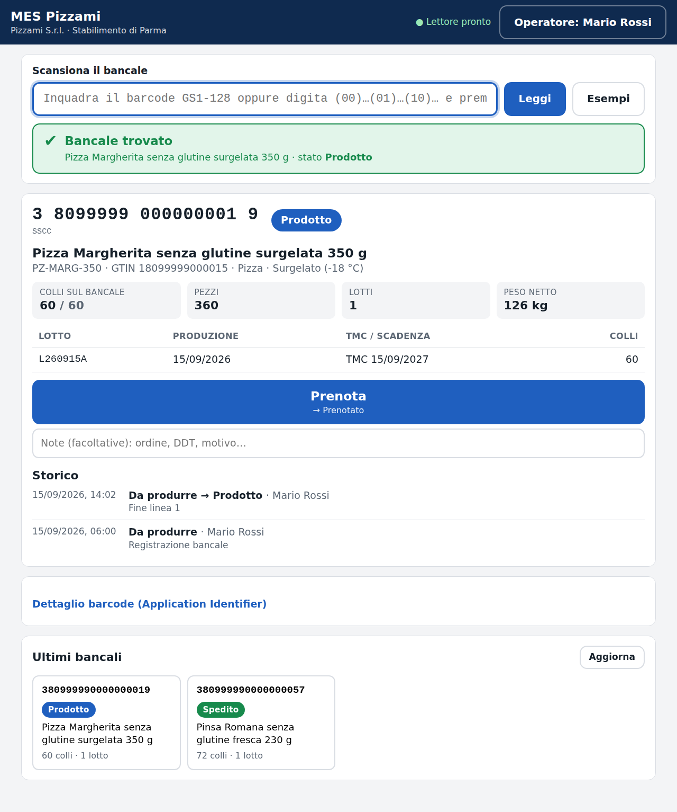
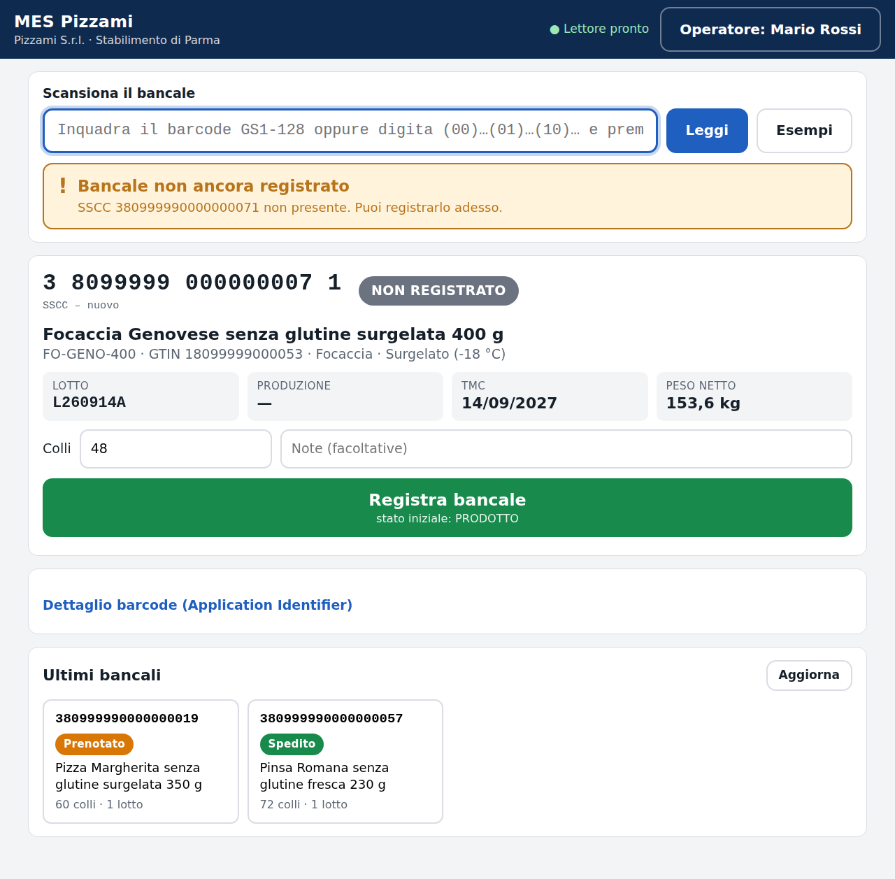
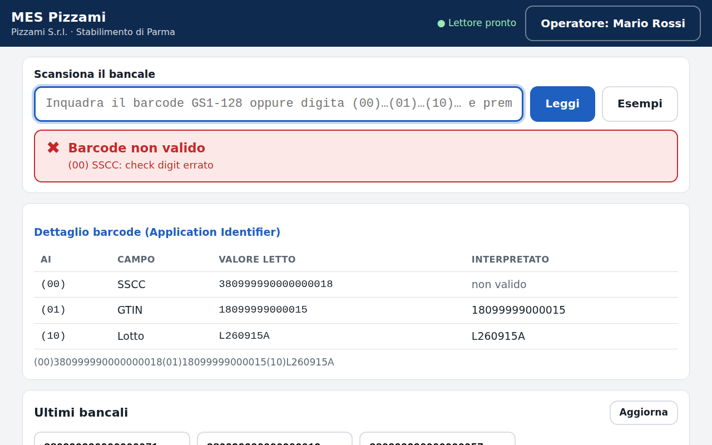

# MES Pizzami – Modulo 1: bancali di prodotto finito e lettura GS1-128

Demo del primo modulo del MES: anagrafica prodotto finito, ciclo di vita del
bancale (Da produrre → Prodotto → Prenotato → Spedito) e lettura di codici a
barre GS1-128 da tablet Windows con lettore in modalità tastiera.

Documenti:

- `docs/PIANO.md` – piano di progetto e motivazioni delle scelte
- `docs/BARCODE_ESEMPIO.md` – barcode di prova coerenti con i dati di esempio

## 1. Database in 5 minuti

### Opzione A (consigliata): SQL Server 2022 in Docker

Richiede Docker Desktop. Dalla cartella `mes-pizzami/db`:

```powershell
cd mes-pizzami\db
docker compose up -d          # scarica l'immagine ufficiale Microsoft e avvia SQL Server
.\run-scripts.ps1             # Windows: crea database, schema, procedure e dati di esempio
```

Su Linux/macOS al posto dello script PowerShell: `./run-scripts.sh`.
Lo script PowerShell usa `sqlcmd` (installato con SSMS o con i "Microsoft
Command Line Utilities for SQL Server"); quello bash usa lo `sqlcmd` già
presente dentro il container, quindi non richiede nulla sul PC.

Stringa di connessione:

```
Server=localhost,1433;Database=MesPizzami;User Id=sa;Password=Pizzami!Demo2026;TrustServerCertificate=True;Encrypt=True
```

Per cambiare la password: modificare `MSSQL_SA_PASSWORD` in
`docker-compose.yml` e passarla agli script (`-Password` oppure variabile
d'ambiente `MSSQL_SA_PASSWORD`).

### Opzione B: SQL Server 2022 Express locale

Installare SQL Server 2022 Express (installazione "Basic"), poi:

```powershell
cd mes-pizzami\db
.\run-scripts.ps1 -Server "localhost\SQLEXPRESS" -WindowsAuth
```

Stringa di connessione:

```
Server=localhost\SQLEXPRESS;Database=MesPizzami;Integrated Security=True;TrustServerCertificate=True
```

### Verifica

```powershell
.\run-scripts.ps1 -Test        # oppure ./run-scripts.sh --test
```

Esegue `test/state-machine.test.sql`: 14 controlli su macchina a stati,
vincoli e soft delete, dentro una transazione annullata alla fine (il
database resta intatto). Con SSMS si può aprire ed eseguire lo stesso file.

## 2. Script SQL

| File | Contenuto |
|------|-----------|
| `db/00_database.sql` | Crea il database `MesPizzami` |
| `db/01_schema.sql` | Schema `mes`: tabelle, chiavi esterne, indici, viste, trigger di soft delete, funzione check digit GS1 |
| `db/02_procedures.sql` | Macchina a stati (`usp_Pallet_ChangeStatus`), registrazione bancale (`usp_Pallet_Register`), bancali misti (`usp_Pallet_AddLot`), log scansioni (`usp_ScanEvent_Insert`), conversione UdM (`fn_ConvertQuantity`) |
| `db/03_seed.sql` | Tenant, stabilimento, 3 operatori, unità di misura, formati, 5 articoli, lotti e 6 bancali nei vari stati |

Tutti gli script sono idempotenti (si possono rieseguire) e usano solo T-SQL
standard: si portano sul server di produzione senza modifiche. Non toccano il
database del gestionale Business Cube: il MES ha un database separato sulla
stessa istanza.

### Regole implementate nel database

- **Audit e soft delete su ogni tabella**: `CreatedAt/By`, `UpdatedAt/By`,
  `IsDeleted`, `DeletedAt`. Un `DELETE` su qualsiasi tabella dello schema
  `mes` viene intercettato da un trigger e trasformato in soft delete.
- **TenantId e PlantId ovunque**, con chiave esterna composta verso `mes.Plant`
  (uno stabilimento non può essere associato al tenant sbagliato). Unica
  eccezione: `mes.Tenant`, che non ha `PlantId` perché lo stabilimento è suo
  figlio.
- **Check digit GS1 verificato dal database**: `CHECK` constraint su
  `Product.Gtin` e `Pallet.Sscc` tramite `mes.fn_IsGs1CheckDigitValid`.
- **Macchina a stati in tabella**: `mes.PalletStatusTransition` elenca le
  transizioni ammesse; `usp_Pallet_ChangeStatus` rifiuta le altre con errore
  50011 e scrive `mes.PalletStatusLog` nella stessa transazione. Per aggiungere
  ad esempio "Annulla prenotazione" (PRENOTATO → PRODOTTO) basta un `INSERT`.
- **Bancale ↔ lotto molti-a-molti** (`mes.PalletLot` con quantità colli):
  il lotto è un'entità propria (`mes.ProductionLot`) con le sue date TMC/
  scadenza; un bancale misto di fine produzione è una seconda riga. I lotti di
  un bancale devono essere dello stesso articolo (controllo in
  `usp_Pallet_AddLot`).
- **Unità di misura**: i fattori pezzo → collo → bancale stanno solo in
  `mes.UomConversion`; la vista `mes.vw_Product` li espone come
  `PiecesPerCase`, `CasesPerPallet`, `PiecesPerPallet` e
  `mes.fn_ConvertQuantity` converte una quantità tra due unità.

### Viste per l'applicazione

| Vista | Uso |
|-------|-----|
| `mes.vw_Product` | Anagrafica articoli con formato, conservazione e fattori risolti |
| `mes.vw_Pallet` | Scheda bancale: articolo, stato, colli totali, numero lotti |
| `mes.vw_PalletLot` | Lotti presenti sul bancale con date |
| `mes.vw_PalletAllowedTransition` | Pulsanti da mostrare: transizioni ammesse dallo stato corrente |
| `mes.vw_PalletStatusLog` | Storico transizioni leggibile (stato da/a, operatore, data, note) |

## 3. Applicazione (Node.js 22 + Express)

```powershell
cd mes-pizzami
npm install
copy .env.example .env      # adattare la password se è stata cambiata
npm start
```

Poi sul tablet aprire `http://<nome-server>:3000/`. In produzione conviene
avviare Edge in modalità chiosco, così l'operatore non vede barra indirizzi né
schede:

```powershell
msedge --kiosk "http://mes-server:3000/" --edge-kiosk-type=fullscreen --no-first-run
```

L'applicazione non richiede installazioni sul tablet: per aggiornarla si
sostituiscono i file sul server.

### Comandi

| Comando | Effetto |
|---------|---------|
| `npm start` | Avvia il server (legge `.env` se presente) |
| `npm run dev` | Come sopra, con riavvio automatico a ogni modifica |
| `npm test` | 37 unit test del parser GS1 (test runner di Node, nessuna libreria) |

### Struttura

```
src/
  gs1/parser.js          parser GS1-128 puro: usato dal server E dal browser
  server/
    index.js             avvio Express, file statici, gestione errori
    db.js                pool SQL Server, contesto tenant/stabilimento
    routes/meta.js       operatori e stati
    routes/products.js   anagrafica articoli
    routes/pallets.js    scansione, dettaglio, registrazione, cambio stato
  web/                   interfaccia tablet (HTML/CSS/JS, nessun build step)
test/gs1.test.js         unit test del parser
```

### Parser GS1-128

Un unico file (`src/gs1/parser.js`) usato dal server per la validazione
autoritativa e servito al browser per il feedback immediato: non esiste una
seconda implementazione che possa divergere.

- Gestisce il prefisso di simbologia (`]C1`), il separatore FNC1/GS (ASCII 29)
  dopo i campi a lunghezza variabile e l'Invio finale del lettore.
- AI supportati: (00) SSCC, (01)/(02) GTIN, (10) lotto, (11) produzione,
  (15) TMC, (17) scadenza, (37) colli, (310x) peso netto. Un AI non previsto
  è un errore esplicito, mai un campo ignorato in silenzio.
- Verifica il check digit modulo 10 di GTIN e SSCC, converte le date AAMMGG in
  date reali (giorno `00` = fine mese, regola GS1 del secolo) e rifiuta mesi o
  giorni inesistenti.
- Accetta anche la notazione con parentesi `(00)…(10)…`, comoda per le prove da
  tastiera dove non si può digitare il carattere ASCII 29. Nell'interfaccia il
  separatore si inserisce a mano con `Ctrl+]`.

### API

| Metodo e percorso | Uso |
|---|---|
| `GET /api/meta` | Stabilimento, operatori, stati |
| `GET /api/products` · `GET /api/products/by-gtin/:gtin` | Anagrafica articoli |
| `GET /api/pallets?limit=` | Ultimi bancali movimentati |
| `GET /api/pallets/:id` | Scheda: bancale, lotti, transizioni ammesse, storico |
| `POST /api/scan` | Scompone il barcode, cerca il bancale, registra la scansione |
| `POST /api/pallets/register` | Crea il bancale dal barcode (stato iniziale PRODOTTO) |
| `POST /api/pallets/:id/transition` | Cambio di stato tramite la stored procedure |

Ogni scansione finisce in `mes.ScanEvent`, anche quelle fallite: resta
traccia di cosa è stato letto e perché è stato rifiutato. Nella registrazione
il server **rianalizza il barcode**: non si fida dei campi inviati dal tablet.
Gli errori delle stored procedure (`THROW 50xxx`) diventano codici HTTP
(409 per una transizione non ammessa, 404 per un GTIN sconosciuto, e così via)
e il messaggio in italiano arriva all'operatore.

### Interfaccia tablet

Una sola schermata. All'avvio si sceglie l'operatore da una lista di pulsanti
grandi (demo senza password); la scelta resta per la sessione del browser.



- Il campo di scansione è sempre a fuoco: torna a fuoco dopo ogni operazione e
  dopo ogni tocco fuori dai campi di testo. In alto a destra un indicatore dice
  se il lettore è pronto.
- Esito immediato: banner verde (bancale trovato, stato aggiornato), giallo
  (bancale nuovo, etichetta di collo) o rosso (barcode o operazione rifiutata),
  con segnale acustico diverso per ciascun caso.
- La scheda mostra SSCC, articolo, colli, lotti con TMC o scadenza, e lo
  storico completo delle transizioni con operatore e note.
- Compaiono **solo** i pulsanti delle transizioni ammesse dallo stato corrente,
  letti da `mes.vw_PalletAllowedTransition`. Un bancale SPEDITO non mostra
  alcun pulsante.
- A ogni nuova scansione la scheda precedente sparisce subito: l'operatore non
  può premere per sbaglio un pulsante del bancale letto prima.
- Se l'SSCC non esiste, compare "Registra bancale" con i colli già compilati
  dal campo (37) del barcode.



Su errore, il dettaglio degli Application Identifier mostra cosa è stato letto
e quale campo è stato rifiutato:



Il pulsante "Esempi" apre i barcode di prova di `docs/BARCODE_ESEMPIO.md`:
serve per la demo senza avere un lettore a portata di mano.

## 4. Stato della verifica

- **Parser GS1**: 37 unit test, tutti superati (`npm test`).
- **Interfaccia**: provata end-to-end con browser automatico contro un'API
  simulata, 26 controlli superati (scansione con lettore, avanzamento di stato,
  registrazione, errori, stato finale).
- **Script SQL**: verificati con un analizzatore sintattico T-SQL e riletti,
  ma **non ancora eseguiti su un'istanza reale**: l'ambiente di sviluppo usato
  non poteva scaricare SQL Server. La prima esecuzione avviene con i comandi
  della sezione 1.
